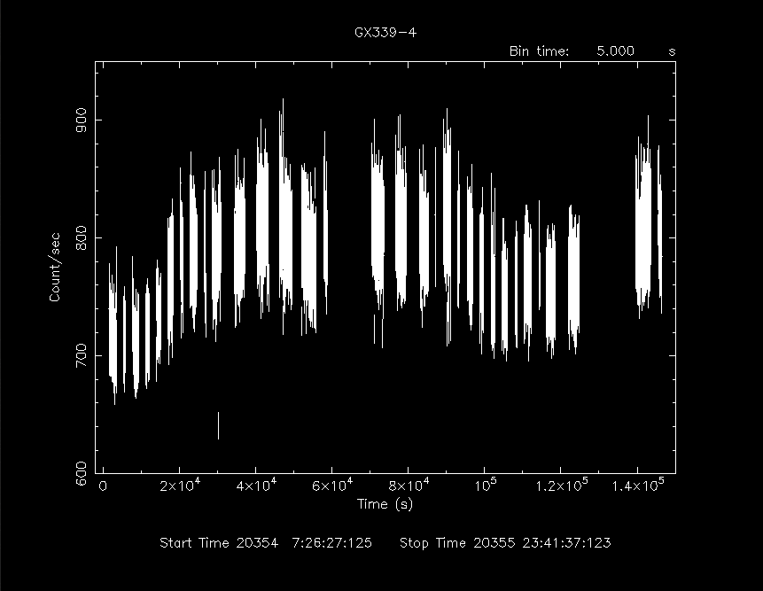
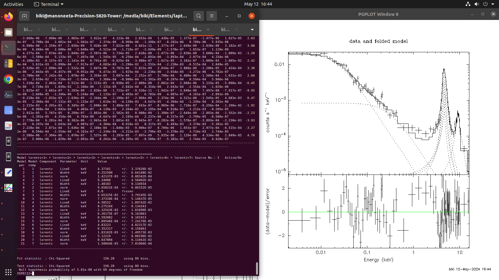
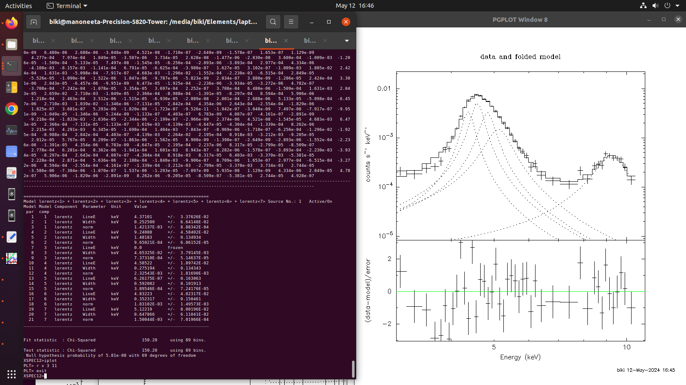
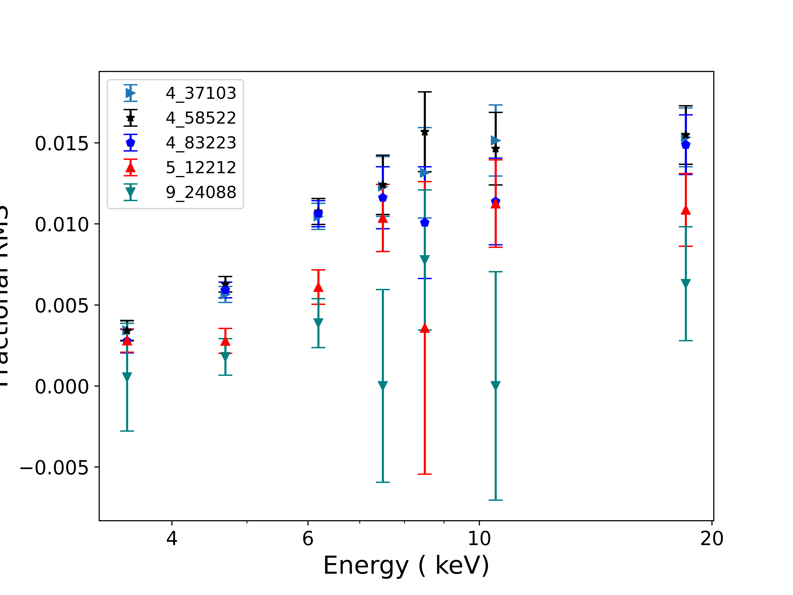
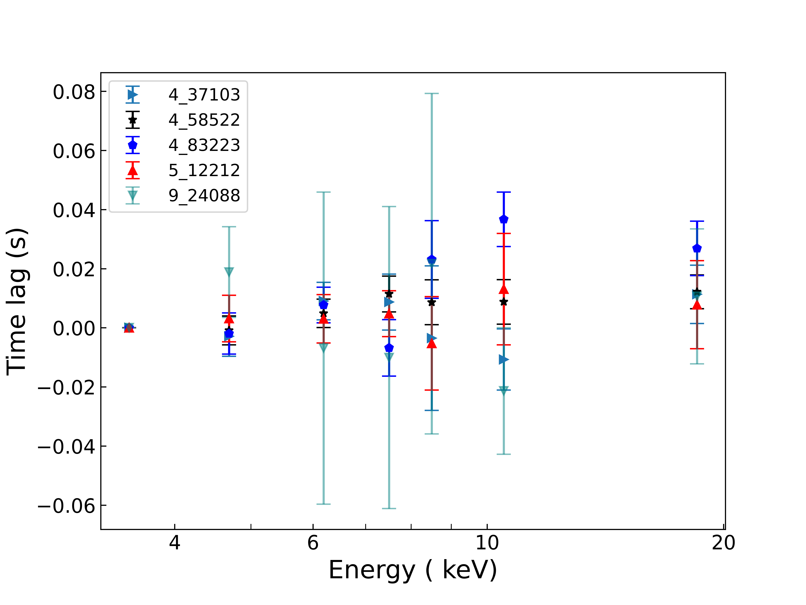
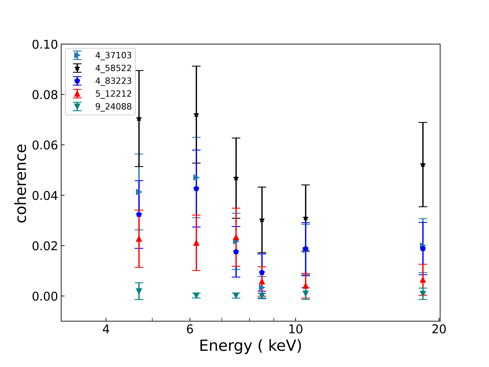
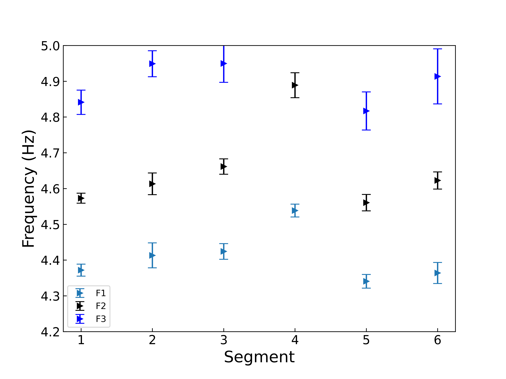

# Gx_339_4_2024_outburst

Obs Id-
Obs Start Time
End time
Exposure

Maxi Light curve

LAXPC light curve

Evolution of the QPO in power spectra

LAXPC power spectra

Zoomed power spectra

RMS evolution at different peaked frequencies

Time Lag evolution for different peaked frequencies

Coherence evolution for different peaked frequencies

# Next I have segmentted the light curve into six segment combinign two consecutive orbit files.

The evolution of lorentzian frequencies 

